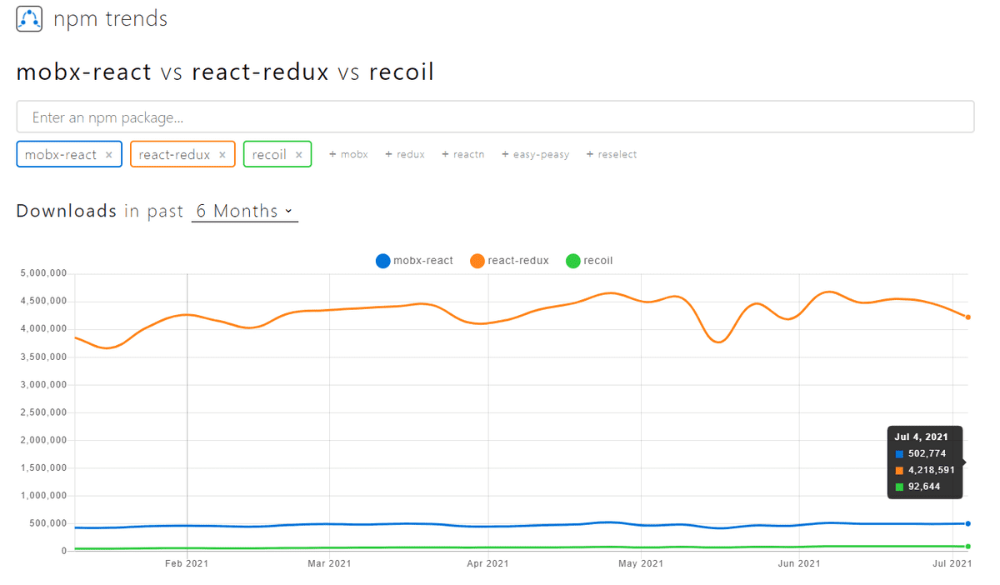

# React - Management of Global State

### Complete
- [x] Redux
- [x] Mobx(mobx-react react version problem)
- [x] Recoil
- [x] Context



### 목적

React 에서는 컴포넌트별 상태 관리가 가능하고 부모에서 자식으로 그 상태 관리를 위한 함수와 변수를 넘겨 이를 관리할 수 있지만 프로젝트 규모가 커질수록 관리가 복잡해지고 불필요한 코드들이 많아진다.

그래서 React 에서 사용하는 전역 상태관리 라이브러리들이 등장했는데 위와 같이 mobx, recoil, redux 등의 상태관리 라이브러리들이 많이 사용되고 있어 이를 알아보려 한다.

---

### 검토

### Redux

---


자바스크립트 앱을 위한 예측 가능한 상태 컨테이너.

우선 redux 를 사용할 때 action, reducer, dispatcher, store, view 의 개념을 이해해야 함.


흐름도

- action: state를 바꾸는 방식. action 객체를 가지며 type 필드를 반드시 가져야 함.
- dispatch: action 객체를 파라미터로 받아 action을 발생시킴.
- reducer: 변화를 일으키는 함수로서 action의 결과로 state를 어떻게 바꿀지 구체적을 정의하는 부분.
- store: 단 한개만 가지는 state의 중앙 저장소.

특징

- 상태를 전역적으로 관리함.
- 데이터 흐름을 단방향으로 흐르게 함.
- 상태를 읽기 전용으로 취급
- redux-thunk, redux-saga 미들웨어들을 통해 dispatch 관리해 [flux 아키텍쳐](https://hannut91.github.io/blogs/flux)를 만들 수 있음.
- 러닝커브가 높음.
- 액션 하나 추가에 작성 필요 부분이 많아 코드량이 많아짐.

### Mobx

---


전역 상태 관리 라이브러리로서 모든 상태변화가 일어나는 부분을 자동으로 추적해주는 역활을 함.

redux에 비해 간결하고 깔금한 구조를 가지며 state, derivations, reactions, actions 의 개념을 이해해야 함.


흐름도

- state: observable state로 관찰되고 있는 데이터로서 변화가 발생하면 reactions, derivations 를 발생시킴.
- derivations: 기존의 상태 변화에 따라 계산된 값.
- reactions: state의 변화에 따른 부가적 변화를 의미하는데 값이 바뀌면서 해야할 일을 정함.
- action: 상태를 변경시키는 모든 것을 의미하는데 mobx 에서 모든 사용자 액션으로 발생하는 상태 변화들이 derivations, reactions로 처리되도록 하는 것.

특징

- react에 종속적 라이브러리가 아니기 때문에 store에 제한이 없다.
- observable을 기본으로 필요시만 state를 변경.

### Recoil

---


recoil은 context API 기반으로 구현된 함수형 컴포넌트에서만 사용 가능한 페이스북에서 만든 라이브러리.

- 동기
    
    호환성 및 단순함을 이유로 외부의 글로벌 상태관리 라이브러리보다는 React 자체에 내장된 상태 관리 기능을 사용하는 것이 가장 좋다. 그러나 React 가 가진 한계는 아래와 같다.
    
    - 컴포넌트의 상태는 공통된 상위요소까지 끌어올림으로써 공유될 수 있지만, 이 과정에서 거대한 트리가 다시 렌더링되기도 함.
    - Context는 단일 값만 저장할 수 있으며, 자체 소비자(consumer)를 가지는 여러 값들의 집합을 담을 수는 없다.
    - 이 두가지 특성이 state가 존재하는 곳부터 state가 사용되는 곳까지의 코드 분할을 어렵게한다.
    
    API와 의미 및 동작을 가능한 React답게 유지하면서 개선하고자 만들어짐.
    
- recoil 특징
    
    Recoil은 방향 그래프를 정의해 React 트리에 붙이는 방식을 사용하며 상태 변화는 이 atoms로부터 selectors를 거쳐 컴포넌트로 흐른다.
    
    - 공유상태(shared state)도 React의 내부상태(local state)처럼 간단한 get/set 인터페이스로 사용.
    - 동시성 모드(Concurrent Mode)를 비롯한 다른 새로운 React의 기능들과의 호환이 가능.
    - 상태 정의는 증분 및 분산되므로 코드 분할이 가능.
    - 상태를 사용하는 컴포넌트를 수정하지 않고도 상태를 파생된 데이터로 대체.
    - 파생된 데이터를 사용하는 컴포넌트를 수정하지 않고도 파생된 데이터는 동기식과 비동기식 간에 이동.
    - 탐색을 일급 개념으로 취급할 수 있고 심지어 링크에서 상태 전환을 인코딩할 수도 있음.
    - 역호환성 방식으로 전체 애플리케이션 상태를 유지하는 것은 쉬우므로, 유지된 상태는 애플리케이션 변경에도 살아남음.
- 주요 개념
    
    atoms(공유 상태)에서 selectors(순수함수)를 거쳐 컴포넌트로 내려가는 data-flow graph를 생성.
    
    - atoms: 상태의 단위. 업데이트, 구독이 가능.
    
    ```jsx
    // 선언
    const fontSizeState = atom({
      key: 'fontSizeState',
      default: 14,
    });
    // 업데이트
    function FontButton() {
    	// useRecoilState를 활용해 읽어 올 수 있음.
      const [fontSize, setFontSize] = useRecoilState(fontSizeState);
      return (
        <button onClick={() => setFontSize((size) => size + 1)} style={{fontSize}}>
          Click to Enlarge
        </button>
      );
    }
    ```
    
    - selectors: atoms 값을 동기 또는 비동기 방식을 통해 변환.
    
    ```jsx
    // 정의
    const fontSizeLabelState = selector({
      key: 'fontSizeLabelState',
      get: ({get}) => {
    		// get을 통해 atoms, selectors에 접근할 수 있다.
        const fontSize = get(fontSizeState);
        const unit = 'px';
        return `${fontSize}${unit}`;
      },
    });
    // 표현
    function FontButton() {
      const [fontSize, setFontSize] = useRecoilState(fontSizeState);
    	// useRecoilValue를 통해 읽어 올 수 있음.
      const fontSizeLabel = useRecoilValue(fontSizeLabelState);
      return (
        <>
          <div>Current font size: ${fontSizeLabel}</div>
          <button onClick={setFontSize(fontSize + 1)} style={{fontSize}}>
            Click to Enlarge
          </button>
        </>
      );
    }
    ```